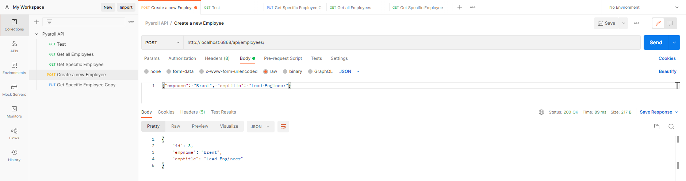

# PayrollAPI
Simple API for interacting with employee data

# Getting Started

1. Java - 1.8.x

2. Maven - 3.x.x

3. Mysql - 5.x.x

**1. Clone the application**

```bash
git clone https://github.com/MatthewDudley/PayrollAPI.git
```

```bash
docker-compose up
```

Test in your browser of using Postman!

<http://localhost:8080/api/test>


<http://localhost:8080/api/employees>


<http://localhost:8080/api/employees>



<http://localhost:8080/api/employees/{id}>


<http://localhost:8080/api/employees/{id}>


# Done

```bash
docker-compose down
```

## References
+ https://www.callicoder.com/
+ https://spring.io/guides/gs/testing-web/
+ https://www.stackabuse.com
+ https://www.bezkoder.com/